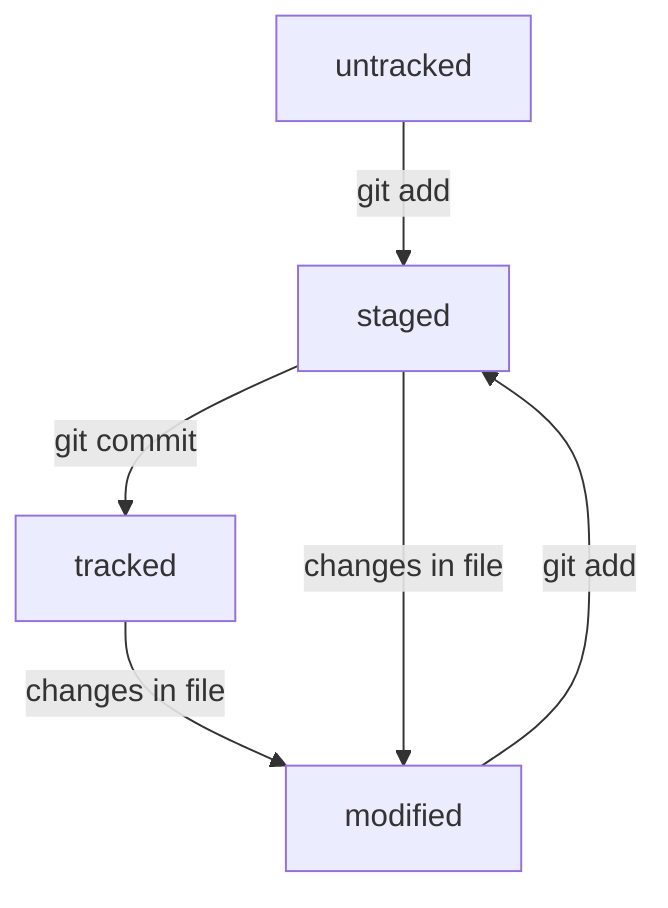

# Git для чайника (меня)
## Установка Git на винду
Переходишь по этой *[ссылке](https://git-scm.com/download/win)*  
Скачиваешь Гит  
Чтобы проверить все, в терминале пишем   
**git version**  
## Настройка Git
При помощи команды   
**git config --global user.name "Имя Фамилия"**   
нужно ввести свое имя или никнейм  
Далее командой   
**git config --global user.email username@gmail.com**   
выставляем действующую электронную почту  
## Создание репозитория на компьютере
Необходимо создать папку, зайти в неё через консоль и инициализировать репозиторий командой   
**git init**  
Далее просто принять все предложения, при желании можно задать ключевую фразу  
## Работа в репозитории и комиты
Чтобы зафиксировать файлы после внесенных изменений   
**git add filename.txt(или --all)**  
Сделать коммит   
**git commit -m "описание изменения"**  
## Создание ssh ключа и привязка Github аккаунта
Чтобы создать ssh ключ (позже он понадобится), заходим в домашнюю папку, создаем или заходим в папку .ssh и пишем команду   
**ssh-keygen -t ed25519 -C "эл. почта к которой привязан github"**   
или   
**ssh-keygen -t rsa -b 4096 -C "эл. почта к которой привязан github"**  
На Github Привязываем файл с расширением .pub (а точнее его содержимое, можно вывести командой cat), ВТОРОЙ ФАЙЛ БЕЗ РАСШИРЕНИЯ НИКОМУ НЕ ДАВАТЬ!!!  
Далее снова заходим в папку репозитория и пишем команду   
**git remote add origin (ссылка из репозитория под флажком ssh)**  
Чтобы проверить привязку пишем   
**git remote -v**  
## Как залить коммиты на Github
Когда привязали репозиторий и синхронизировали его с удаленным репозиторием, можем уже заливать коммиты в сеть, для этого пишем команду  
**git push -u origin master(или main, смотря как называется главная ветка)**   
Так команда выглядит только в первый раз, дальше можем писать просто  
**git push**  
## Разбираемся в логах
Когда мы пишем команду  
**git log**   
В результате мы получаем список коммитов с четырьмя составляющими:   
1. Хэш коммита (об этом читай ниже)
2. Автор коммита и его эл. почта
3. Дата коммита
4. Сообщение коммита
### Что же такое хэш?
Хэш -- это зашифрованная информация о коммите, в которой хранится дата, имя, сообщение и содержимое коммита   
Если одну и ту же информацию хэшировать, то вне зависимости от того, с какого устройства это было сделано, хэш будет одинаковым   
Так же хэш можно использовать как идентификатор коммита в некоторых командах git  
При помощи команды  
**git log --oneline**  
Мы можем получить сокращенный журнал логов, где будет выводиться только сокращенный хэш, длину которого git подбирает сам так, чтобы он был индивидуален, а так же сообщение коммита  
Сокращенный хэш так же можно использовать вместо полного в командах git  
## HEAD
Как мы могли заметить, в логе самого последнего коммита появляется сообщение в котором фигурирует слово HEAD и название вашей основной ветки. Так вот, HEAD это файл в папке .git, содержащий ссылку /refs/heads/master, по этому адресу хранится хэш самого последнего коммита, обновляющийся с каждым коммитом  
Так же как и хэш, при необходимости обратиться к самому последнему коммиту можно использовать HEAD, git поймет что вы имели в виду и обратится к самому последнему коммиту  
## Состояния файлов
В Git есть четыре основных состояния файла:  
1. untracked (не отслеживается)
2. tracked (отслеживается)
3. staged (готов к коммиту)
4. modified (модифицирован до коммита)
Работают они так:

## Оформление сообщений коммитов
Сообщения должны быть короткими и информативными, поскольку сокращенный лог вмещает только 72 символа.   
Сообщения должны состоять из первого слова, описывающего изменение (добавить, исправить, поменять и т.д.) с последующими словами, описывающими место и характер изменения